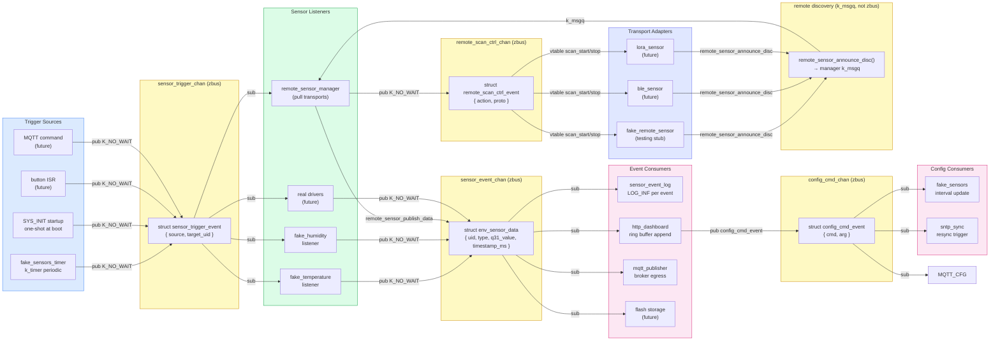
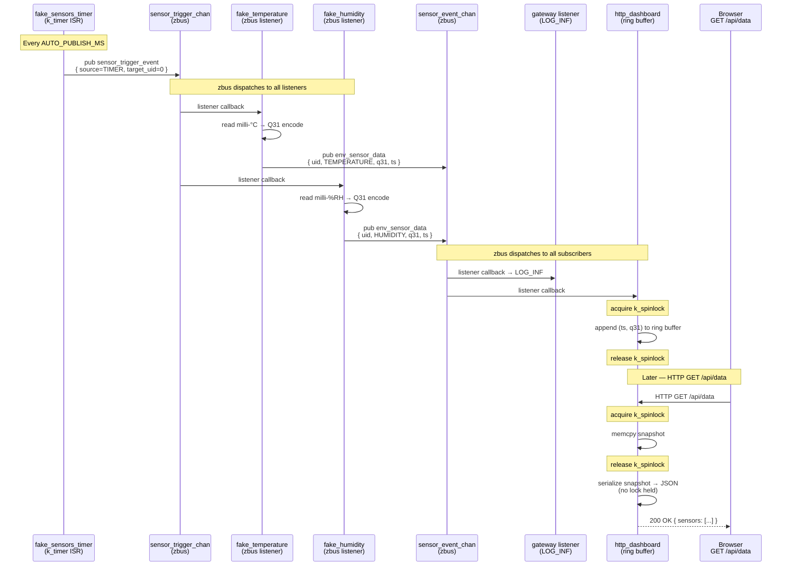
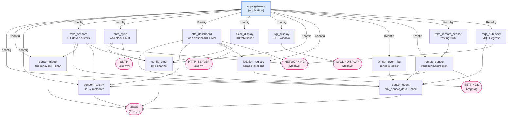
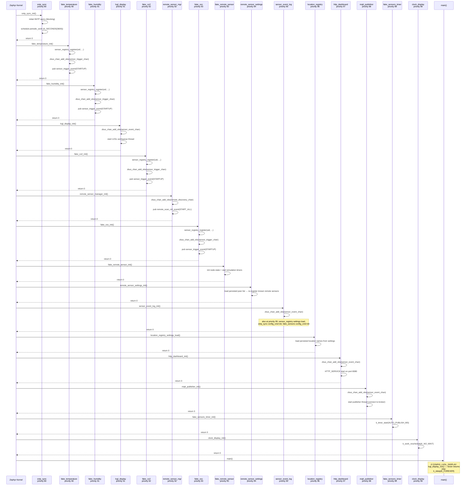
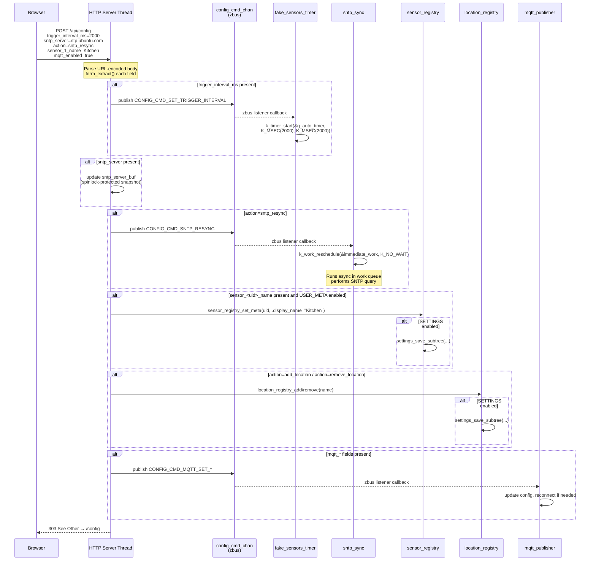

# Architecture Diagrams

All diagrams are authored as Mermaid source files in this page. They render
client-side via the MkDocs Mermaid plugin.

## System Overview

Layered component view of the weather-station firmware.

```mermaid
graph TB
    subgraph APP["APPLICATION LAYER"]
        GW["apps/gateway\nmain.c <50 lines\nprj.conf (features)"]
        SN["apps/sensor-node\npipe_publisher egress\nprj.conf (lighter stack)"]
    end

    subgraph LIBS["LIBRARY LAYER (lib/)"]
        direction TB
        subgraph CHANNELS["zbus Channels"]
            SEC["sensor_event\n(env_sensor_data)"]
            STC["sensor_trigger\n(trigger event)"]
        end
        subgraph SENSORS["Sensor Layer"]
            FS["fake_sensors\nDT-driven drivers\n+ auto-publish timer"]
            SR["sensor_registry\nuid → metadata"]
        end
        subgraph SERVICES["Services"]
            SNTP["sntp_sync\nwall-clock SNTP"]
            HTTP["http_dashboard\nChart.js + config API\nport 8080"]
            CLK["clock_display\nHH:MM UTC ticker"]
            LVGL["lvgl_display\nSDL window (native_sim)"]
            CC["config_cmd\ncmd channel"]
            LOC["location_registry\nnamed locations"]
            SEL["sensor_event_log\nconsole logger"]
            RS["remote_sensor\ntransport abstraction + manager"]
            FRS["fake_remote_sensor\ntesting stub"]
            MQTT["mqtt_publisher\nMQTT egress"]
            PIPE_PUB["pipe_publisher\nFIFO protobuf writer\n(sensor-node)"]
            PIPE_TX["pipe_transport\nFIFO protobuf reader\n(gateway)"]
        end
    end

    subgraph RTOS["ZEPHYR RTOS"]
        ZBUS["zbus pub/sub"]
        KTIMER["k_timer"]
        KWORK["k_work_delayable"]
        KSPIN["k_spinlock"]
        KMUX["k_mutex"]
        HTTPD["HTTP_SERVER"]
        NET["NET_SOCKETS / SNTP"]
        LVGLLIB["LVGL / SDL2"]
    end

    GW -->|"Kconfig selects"| LIBS
    SN -->|"Kconfig selects"| LIBS

    FS -->|publishes| SEC
    FS -->|subscribes| STC
    FS -->|subscribes| CC
    HTTP -->|subscribes| SEC
    HTTP -->|reads| SR
    HTTP -->|reads| LOC
    HTTP -->|publishes| CC
    FS -->|registers| SR
    SNTP -->|subscribes| CC
    SEL -->|subscribes| SEC
    RS -->|publishes| SEC
    RS -->|subscribes| STC
    FRS -->|implements vtable| RS
    MQTT -->|subscribes| SEC
    PIPE_PUB -->|publishes| SEC
    PIPE_PUB -->|writes FIFO| SEC
    PIPE_TX -->|reads FIFO| SEC
    PIPE_TX -->|publishes| SEC

    SEC --> ZBUS
    STC --> ZBUS
    SNTP --> NET
    HTTP --> HTTPD
    CLK --> KWORK
    SNTP --> KWORK
    FS --> KTIMER
    HTTP --> KSPIN
    SR --> KMUX
    LVGL --> LVGLLIB

    style APP fill:#dbeafe,stroke:#3b82f6
    style LIBS fill:#dcfce7,stroke:#16a34a
    style CHANNELS fill:#fef9c3,stroke:#ca8a04
    style SENSORS fill:#f0fdf4,stroke:#16a34a
    style SERVICES fill:#f0fdf4,stroke:#16a34a
    style RTOS fill:#fce7f3,stroke:#db2777
```

## zbus Channel Map

Publishers, channels, and subscribers across the zbus event bus.

## Sensor Data Flow

Sensor trigger → event → consumers sequence.

## Library Dependencies

Inter-library dependency graph.

## Boot Sequence

SYS_INIT boot ordering by priority.

## HTTP Config Flow

POST /api/config side-effects.

